# 🎒 EduSub – Teacher Substitute Management System

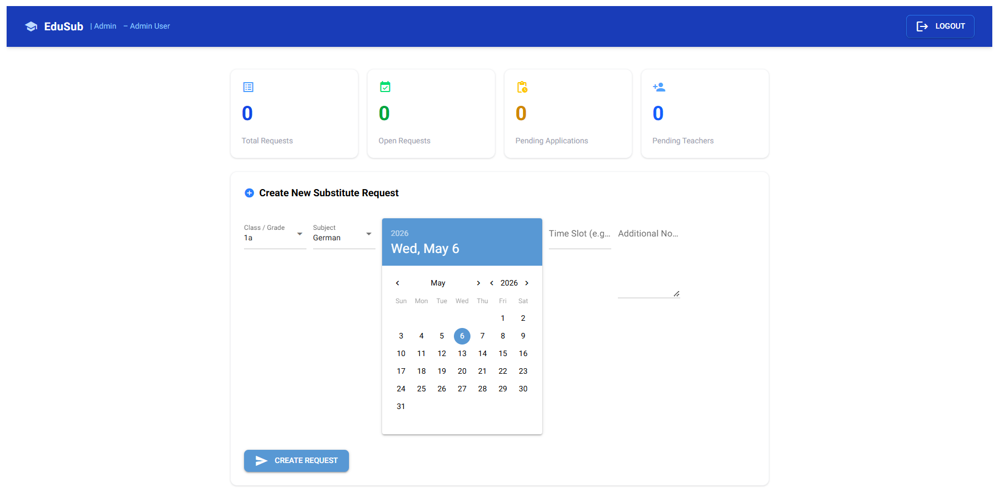

EduSub is a browser-based application developed for the course Advanced Programming (BSc BIT, FHNW). The system supports school management in coordinating teacher substitute assignments in case of absence.
---

This project is intended to:

- Practice the complete process from **application requirements analysis to implementation**
- Apply advanced **Python** concepts in a browser-based application (NiceGUI)
- Demonstrate **data validation**, a clean architecture (presentation / application logic / persistence), and **database access via ORM**
- Produce clean, well-structured, and documented code (incl. tests)
- Prepare students for **teamwork and professional documentation**
- Use this repository as a starting point by importing it into your own GitHub account  
- Work only within your own copy — do not push to the original template  
- Commit regularly to track your progress

---

## 📝 Application Requirements

---

### Problem
In primary schools, when a teacher becomes ill or unavailable, the school management must quickly find a substitute teacher. This process is often handled through phone calls or messages, which can lead to delays and miscommunication. As a result, it becomes difficult to efficiently coordinate substitute assignments, track request statuses, and ensure that all classes are covered in time. EduSub addresses this problem by providing a centralized web-based platform that streamlines the creation, management, and assignment of substitute requests, improving efficiency, transparency, and reliability in the process.

---

### Scenario

When a teacher is absent:

1. The school manager (admin) logs into the system.
2. The school manager creates a substitute request including subject and date.
3. The request is stored in the system and marked as "open".
4. Substitute teachers log into the system and view all open requests.
5. A substitute teacher selects and accepts a suitable request.
6. The system assigns the request to the teacher and updates the status to "accepted".
7. The school manager can view the updated request status.
8. The system prevents multiple teachers from accepting the same request.
9. All assignments are stored and can be reviewed later by the admin.
10. Unauthorized users are prevented from accessing restricted features.

The platform ensures transparency, prevents double bookings, and maintains historical records.

In rare exceptional cases, if a substitute teacher cancels or rejects the assignment shortly before the lesson begins and no replacement can be found in time, the school manager temporarily takes over the class until a new substitute teacher is assigned.

---

### User stories

### 1. Login
**User Story:**  
As a user, I want to log into the system so that I can access my personal dashboard.

**Description:**  
The user enters their email and password on the login page. The system verifies the credentials and redirects the user to the appropriate dashboard based on their role.

**Inputs:**
- email  
- password  

**Outputs:**
- successful login confirmation  
- redirect to personal dashboard  
- error message if login fails  

---

### 2. Create Substitute Request
**User Story:**  
As a school manager, I want to create a substitute request so that I can quickly find a replacement teacher.

**Description:**  
The school manager creates a new request by entering the required details. The system stores the request and makes it available to substitute teachers.

**Inputs:**
- school name  
- subject
- date and time
- notes (optional)  

**Outputs:**
- confirmation that the request was created  
- request appears in the list  
- status set to "open"  

---

### 3. View Open Requests
**User Story:**  
As a substitute teacher, I want to see all open substitute requests so that I can choose suitable assignments.

**Description:**  
The substitute teacher views a list of all currently open requests in the system.

**Inputs:**
- logged-in session  

**Outputs:**
- list of open requests  
- request details (school, subject, date / time, etc.)  

---

### 4. Accept Substitute Request
**User Story:**  
As a substitute teacher, I want to accept a request so that the school knows I will take the assignment.

**Description:**  
The substitute teacher selects an open request and accepts it. The system assigns the request and updates its status.

**Inputs:**
- request_id  
- logged-in session  

**Outputs:**
- confirmation of acceptance  
- request status updated to "accepted"

---

### 5. View Accepted Assignments
**User Story:**  
As a substitute teacher, I want to view my accepted assignments so that I can manage my schedule.

**Description:**  
The teacher views all assignments that have been accepted.

**Inputs:**
- logged-in session  

**Outputs:**
- list of accepted assignments  
- assignment details

---

### 6. View Request Status
**User Story:**  
As a school manager, I want to see who accepted a request so that planning is reliable.

**Description:**  
The manager views the status of each request and sees which teacher has accepted it.

**Inputs:**
- request_id  
- logged-in session  

**Outputs:**
- request status  
- assigned teacher information

---

### 7. Cancel Substitute Request
**User Story:**  
As a school manager, I want to cancel a request so that outdated or unnecessary requests are removed.

**Description:**  
The manager cancels an existing request. The system updates the status and removes it from open requests.

**Inputs:**
- request_id  

**Outputs:**
- cancellation confirmation  
- status updated to "cancelled"  

---

### 8. Manage Users and Roles
**User Story:**  
As an admin, I want to add users and roles so that only authorized users can access the system.

**Description:**  
The admin creates and assigns roles.

**Inputs:**
- user_id  
- name  
- email  
- role  

**Outputs:**
- updated user list  
- confirmation of changes  

---

### 9. View Assignment History
**User Story:**  
As an admin, I want to view past assignments so that I can monitor system activity.

**Description:**  
The admin reviews historical assignment data.

**Inputs:**
- logged-in admin session  
- optional filters  

**Outputs:**
- list of past assignments  
- status and activity overview

---

### 10. Prevent Double Booking
**User Story:**  
As an admin, I want to prevent multiple teachers from accepting the same request so that scheduling conflicts are avoided.

**Description:**  
When a substitute teacher tries to accept a request, the system checks whether the request has already been accepted by another teacher. If so, the system blocks the action and informs the user.

**Inputs:**
- request_id   
- logged-in session

**Outputs:**
- success confirmation if request is still available
- error message if request is already assigned
- request status remains consistent
---

### Use cases

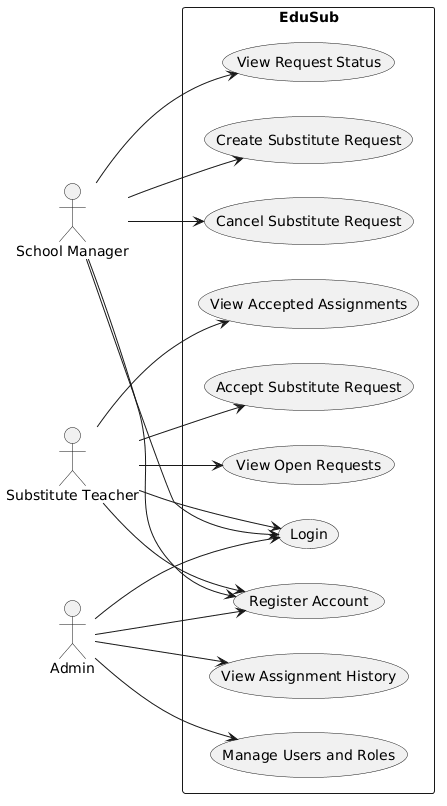
  


**Actors**

– **School Manager**  
Creates substitute requests, manages and confirms assignments.

– **Substitute Teacher**  
Views open requests, accepts assignments, and manages own schedule.

– **Admin**  
Manages users, roles, schools, and monitors system activity.

**Use cases**

1. **Login (All Users)**  
   Users log into the system using email and password.  
   → System authenticates user and redirects to the correct dashboard.

2. **Register Account (All Users)**  
   A new user creates an account by entering personal details and selecting a role.  
   → Account is stored in the system.

3. **Create Substitute Request (School Manager)**  
   School Manager creates a request for a substitute teacher.  
   → Request becomes visible to substitute teachers.

4. **View Open Requests (Substitute Teacher)**  
   Substitute Teacher views available substitute requests.  
   → List of open requests is displayed.

5. **Accept Substitute Request (Substitute Teacher)**  
   Substitute Teacher accepts a request.  
   → Request is assigned to the teacher.

6. **View Accepted Assignments (Substitute Teacher)**  
   Substitute Teacher views all accepted assignments.  
   → Personal assignment list is shown.

7. **View Request Status (School Manager)**  
   School Manager checks the status of requests.  
   → Status (open, accepted, completed) is displayed.

8. **Cancel Substitute Request (School Manager)**  
   School Manager cancels an existing request.  
   → Request is removed or marked as cancelled.

9. **Manage Users and Roles (Admin)**  
   Admin creates, updates, or deletes users and roles.  
   → System user data is updated.

10. **View Assignment History (Admin)**  
    Admin reviews past assignments and system activity.  
    → Historical data is displayed.

---

### Wireframes / Mockups

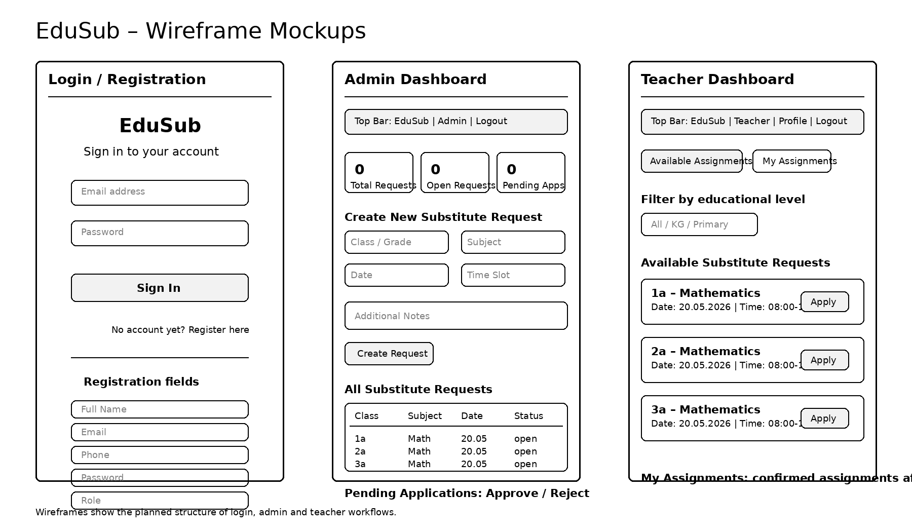

---

## 🏛️ Architecture

### Software Architecture

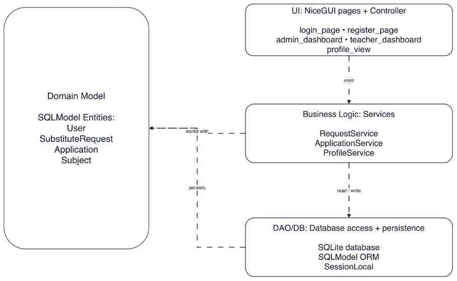

**Layers / components:**
- **UI:** NiceGUI pages (login, register, admin_dashboard, teacher_dashboard, profile_view)
- **Application Logic:** Controllers + Services (RequestService, ApplicationService, ProfileService)
- **Persistence:** SQLite + SQLModel ORM + SessionLocal

**Design decisions:**
- MVC structure:
   * Model: ORM entities (User, SubstituteRequest, Application, Subject)
   * View: NiceGUI pages
   * Controller: UI event handlers calling service methods
* Clear separation of concerns (UI, logic, database)
* Business logic is independent of UI (services can be tested separately)
* Modular structure to reduce dependencies and improve maintainability

**Design patterns used (examples):**
- Model–View–Controller (MVC): separates UI, logic, and persistence
- Service Layer Pattern: business logic is encapsulated in services
- Repository/DAO Pattern: database access via ORM (no raw SQL)
- Facade Pattern: database.py hides database setup and session handling

---

### 🗄️ Database and ORM

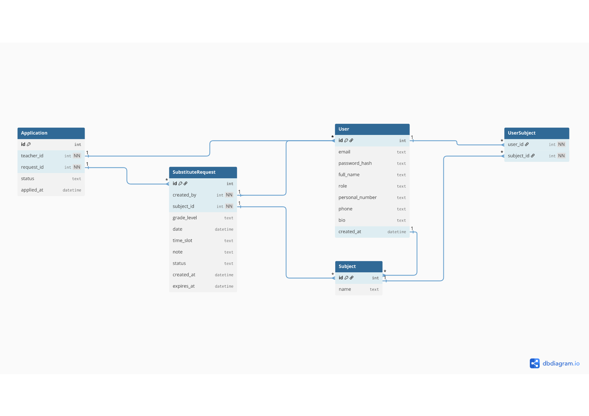

**ORM and Entities:** In the database, substitute requests, users, applications, and subjects are stored and mapped to ORM entities (User, SubstituteRequest, Application, Subject).

* The User ↔ SubstituteRequest relationship ensures that each request is created by one user (admin), while one user can create multiple requests.
* The SubstituteRequest ↔ Application relationship ensures that one request can have multiple applications, but each application belongs to exactly one request.
* The User ↔ Application relationship ensures that a teacher can apply to multiple requests, while each application belongs to one teacher.
* The User ↔ Subject relationship is modeled via the UserSubject table, representing a many-to-many relationship (a user can have multiple subjects and a subject can belong to multiple users).

---

## ✅ Project Requirements

---

Each app must meet the following criteria in order to be accepted (see also the official project guidelines PDF on Moodle):

1. Using NiceGUI for building an interactive web app
2. Data validation in the app
3. Using an ORM for database management

---

### 1. Browser-based App (NiceGUI)

EduSub is a fully browser-based web application built with NiceGUI. The browser acts as a thin client, while UI state, routing, session handling, and business logic are handled server-side.

Users can:
- register and log in
- access role-based dashboards
- create and manage substitute requests
- view open substitute assignments
- apply for assignments
- approve or reject applications
- view assignment and request history

The application uses NiceGUI pages such as `login_page`, `register_page`, `admin_dashboard`, `teacher_dashboard`, and `profile_view`.

**Architecture note (per SS26 guidelines):** the browser is a thin client; UI state + business logic live on the server-side NiceGUI app.

---

### 2. Data Validation


The application validates user input to ensure data integrity and a reliable coordination process.

Validation includes:

- required fields during registration and login
- password length validation
- unique email check during registration
- required fields when creating substitute requests
- date validation to prevent requests in the past
- time slot format validation
- role-based access control for protected pages
- duplicate application prevention
- request status checks before accepting or approving applications

These checks prevent inconsistent data, unauthorized access, duplicate applications, and scheduling conflicts.

---

### 3. Database Management

All persistent data is managed using an ORM with a SQLite database. The ORM maps Python classes to database tables and allows database operations without raw SQL.

The database stores:

- users
- substitute requests
- applications
- subjects
- user-subject relationships

Main ORM entities:

- `User`
- `SubstituteRequest`
- `Application`
- `Subject`

The persistence layer uses `SessionLocal` for database sessions and service classes such as `RequestService`, `ApplicationService`, and `ProfileService` to access and update data.

---

## ⚙️ Implementation

---

### Technology

| Component        | Choice    | Purpose                                                 |
| ---------------- | --------- | ------------------------------------------------------- |
| UI framework     | NiceGUI   | Python-native reactive web UI; no separate frontend     |
| Database         | SQLite    | Embedded, zero-config storage in a single file          |
| ORM              | SQLModel  | Type-safe models combining SQLAlchemy and Pydantic      |
| Password hashing | bcrypt    | Industry-standard salted password hashing               |
| Testing          | pytest    | Test runner with fixtures and coverage support          |

---

### 📂 Repository Structure

```text
edusub/
├── main.py                     # Entry point: starts NiceGUI server on :8080
├── requirements.txt            # Pinned Python dependencies
├── edusub.db                   # SQLite database (auto-created on first run)
│
├── app/
│   ├── __init__.py             # Marks app/ as a package
│   ├── config.py               # Settings: port, DB URL, session lifetime
│   ├── database.py             # SQLModel engine, session helper, init_db()
│   ├── seed.py                 # Inserts default admin and teacher on first boot
│   │
│   ├── models/
│   │   ├── __init__.py
│   │   ├── user.py             # User ORM: id, email, password_hash, role
│   │   └── request.py          # SubstitutionRequest ORM: dates, status, etc.
│   │
│   ├── auth/
│   │   ├── __init__.py
│   │   ├── hashing.py          # bcrypt hash/verify wrappers
│   │   ├── session.py          # Login state stored per browser session
│   │   └── guards.py           # require_login, require_admin decorators
│   │
│   ├── pages/
│   │   ├── __init__.py
│   │   ├── login.py            # / and /login: credential form
│   │   ├── dashboard.py        # /dashboard: role-aware landing page
│   │   ├── new_request.py      # /requests/new: teacher submits a request
│   │   ├── my_requests.py      # /requests/mine: teacher's own history
│   │   ├── approvals.py        # /approvals: admin queue (approve/reject)
│   │   └── users.py            # /users: admin user management
│   │
│   └── services/
│       ├── __init__.py
│       ├── requests_service.py # Business logic: create, approve, reject
│       └── users_service.py    # Create users, lookup, role changes
│
└── tests/
    ├── __init__.py
    ├── conftest.py             # Shared fixtures: in-memory DB, test client
    ├── test_auth.py            # Hashing, login flow, role guards
    ├── test_requests.py        # Request lifecycle and validation rules
    └── test_admin.py           # Approval workflow and admin-only access
```

---

### Routes and access levels

| Route             | Method   | Access            | Purpose                                  |
| ----------------- | -------- | ----------------- | ---------------------------------------- |
| `/`               | GET      | Public            | Redirects to `/login` or `/dashboard`    |
| `/login`          | GET/POST | Public            | Email + password authentication          |
| `/logout`         | POST     | Authenticated     | Clears the session and redirects to `/` |
| `/dashboard`      | GET      | Authenticated     | Landing page; differs by role            |
| `/requests/new`   | GET/POST | Teacher           | Submit a new substitution request        |
| `/requests/mine`  | GET      | Teacher           | View own past and pending requests       |
| `/approvals`      | GET      | Admin             | Queue of pending requests                |
| `/approvals/{id}` | POST     | Admin             | Approve or reject a specific request     |
| `/users`          | GET      | Admin             | List all users                           |
| `/users/new`      | GET/POST | Admin             | Create a new teacher or admin            |

---

### ORM entities

| Entity                 | Field             | Type            | Notes                                |
| ---------------------- | ----------------- | --------------- | ------------------------------------ |
| **User**               | id                | int, PK         | Auto-increment                       |
|                        | email             | str, unique     | Used as the login identifier         |
|                        | password_hash     | str             | bcrypt output, never plaintext       |
|                        | role              | enum            | `admin` or `teacher`                 |
|                        | created_at        | datetime        | Set on insert                        |
| **SubstitutionRequest**| id                | int, PK         | Auto-increment                       |
|                        | teacher_id        | int, FK → User  | The teacher submitting               |
|                        | date              | date            | Day the substitute is needed         |
|                        | period            | str             | e.g. lesson slot or time range       |
|                        | subject           | str             | Subject to be covered                |
|                        | reason            | str             | Free-text justification              |
|                        | status            | enum            | `pending`, `approved`, `rejected`    |
|                        | created_at        | datetime        | Set on insert                        |
|                        | decided_at        | datetime, null  | Set when admin acts on it            |
|                        | decided_by        | int, FK, null   | The admin who decided                |
|                        | expires_at        | datetime        | Auto-expiry cutoff                   |

---

### Key design decisions

**Role guards as decorators.** Access control lives in `app/auth/guards.py` as `@require_login` and `@require_admin` decorators applied at the page handler level. This keeps authorization logic out of business code and makes it impossible to register a protected route without explicitly declaring its required role.

**Two-step approval workflow.** Teachers create requests in `pending` state; only an admin can transition them to `approved` or `rejected`. Once decided, a request is immutable, `decided_at` and `decided_by` are stamped, and the status field is locked. This produces a clean audit trail without needing a separate history table.

**Automatic expiry.** Each request carries an `expires_at` timestamp (defaulting to the requested date itself). The approvals page filters out expired pending requests so admins are never shown stale items, and an expired request can no longer be approved even via a crafted URL.

**Duplicate prevention.** When a teacher submits a new request, the service layer checks for an existing non-rejected request from the same teacher for the same `(date, period)` pair. If one exists, submission is refused with a clear error message. This avoids accidental double-bookings without requiring a complex unique constraint that would block legitimate re-submission after a rejection.

---

### How to Run

#### Prerequisites

- **Python 3.10 or newer** (check with `python --version`)
- `pip` and `venv` (bundled with modern Python distributions)
- A modern web browser (Chrome, Firefox, Safari, Edge)

#### Virtual environment setup

**macOS / Linux**

```bash
python3 -m venv .venv
source .venv/bin/activate
```

**Windows (PowerShell)**

```powershell
python -m venv .venv
.\.venv\Scripts\Activate.ps1
```

**Windows (cmd)**

```cmd
python -m venv .venv
.venv\Scripts\activate.bat
```

#### Install dependencies

```bash
pip install -r requirements.txt
```

#### Start the application

```bash
python main.py
```

The app will be available at **http://localhost:8080**.

#### Database notes

On the **first startup**, the application will:

1. Automatically create the SQLite database file (`edusub.db`) in the project root.
2. Run all required migrations to set up the schema (users, substitution requests, etc.).
3. Seed the database with two default accounts (see [Default Accounts](#-default-accounts)).

No manual database setup or external service (Postgres, MySQL, etc.) is required. To reset the system to a clean state, simply stop the app, delete `edusub.db`, and restart — it will be recreated and re-seeded.

---

### 🔑 Default Accounts

The first time the app starts, two accounts are seeded automatically:

| Role    | Email               | Password     |
| ------- | ------------------- | ------------ |
| Admin   | `admin@edusub.ch`   | `admin123`   |
| Teacher | `teacher@edusub.ch` | `teacher123` |

> **Security note:** These credentials are intended for local development and first-run demos only. Change them immediately in any non-throwaway deployment. Log in as the admin, create new accounts, and remove or update the seeded ones.

---

### Usage (document as steps)

Usage (Documentation Steps)
1. Open the EduSub application in the browser
2. Register a new account or log in with existing credentials
3. Navigate through the dashboard based on your role
4. Use the available features such as creating requests or applying for assignments

Admin: Approve Application
1. Teacher applies for an open request
2. Admin sees application in “Pending Applications” section
3. Click on teacher’s personal number to view profile and documents
4. Click “Approve” -> request status changes to FILLED, teacher sees confirmed assignment

Teacher: Apply for Assignment
1. Log in with teacher credentials
2. Browse open assignments in “Available Assignments” tab
3. Filter by educational level (KG / Primary) if needed
4. Click “Apply” -> application sent to admin for review
5. Check “My Assignments” tab after admin approval

## UI Screenshots

### Create Account
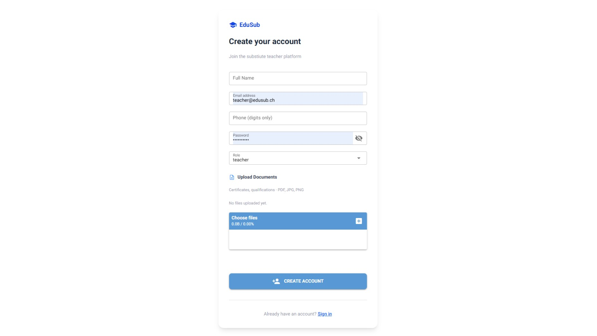

---

### Available Assignments
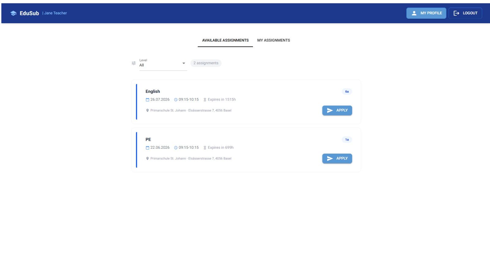

---

### Accepted Assignments
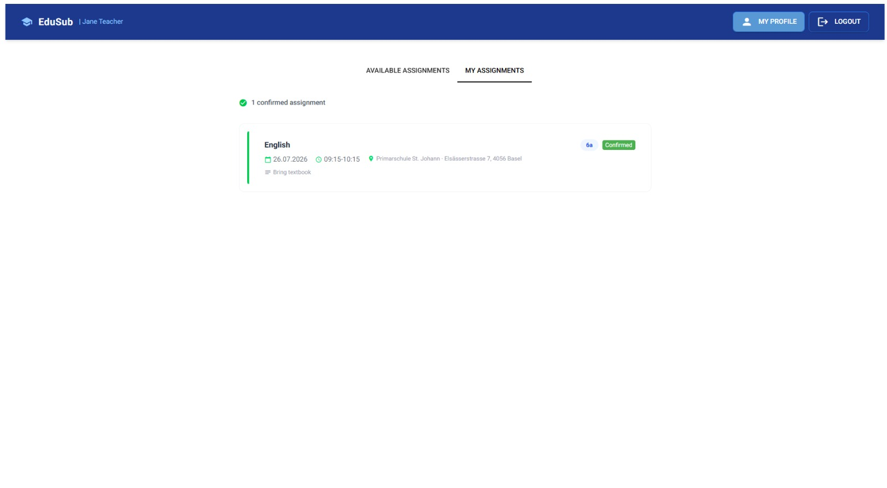

---

### Admin – Pending Applications
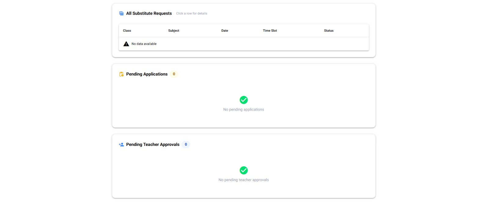

---

### Admin – Approve Application
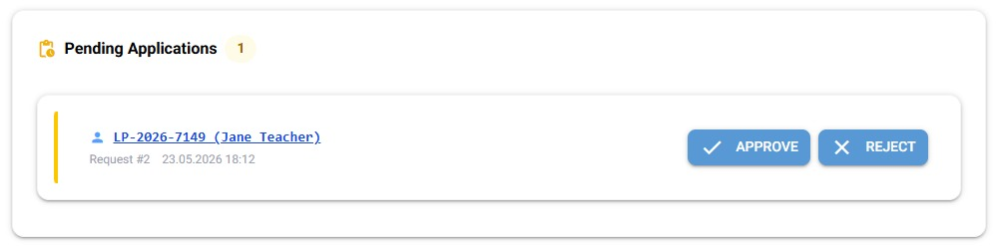


---

## 🧪 Testing

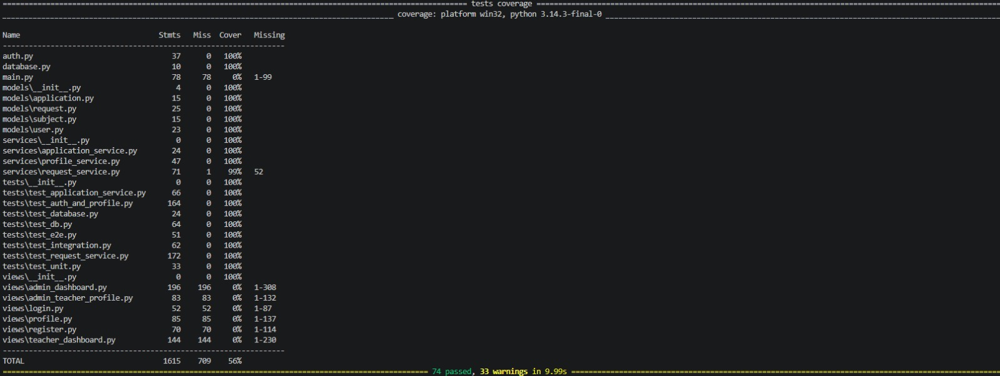

### Why Views and `main.py` Are Not Unit-Tested

NiceGUI views (`views/`) and `main.py` cannot be unit-tested directly because they require a running browser session and web server.

NiceGUI dynamically creates UI components in the browser using WebSockets, meaning UI elements cannot be instantiated or asserted without a live browser environment.

Testing these components would require browser automation or end-to-end testing frameworks such as:

- Playwright
- Selenium

Setting up and maintaining these tests is significantly more complex and was outside the scope of this course project.

### What Is Tested

The automated tests fully cover the core business logic of the application, including:

- Authentication and login functionality
- Request validation
- Database operations using SQLModel
- Assignment workflows
- Application approval and rejection logic
- Service layer functionality
- Integration between services and database models

### How to run

```bash
# Run all tests
pytest

# Verbose output, one line per test
pytest -v

# With coverage report
pytest --cov=app --cov-report=term-missing
```

Tests run against an **in-memory SQLite database** seeded fresh for each test, so they never touch `edusub.db` and can be run in any environment without setup.

### Test files

| File                     | Coverage area                                                              |
| ------------------------ | -------------------------------------------------------------------------- |
| `tests/test_auth.py`     | Password hashing, login flow, session handling, role-based access guards   |
| `tests/test_requests.py` | Substitution request creation, validation, duplicate prevention, expiry    |
| `tests/test_admin.py`    | Admin approval workflow, rejection, audit fields, admin-only route access  |

### Individual test cases

**`tests/test_auth.py`**

- `test_password_hash_is_not_plaintext` -> confirms bcrypt is applied and the stored hash never equals the input password.
- `test_password_verify_accepts_correct_password` -> `verify(password, hash)` returns `True` for the original password.
- `test_password_verify_rejects_wrong_password` -> `verify` returns `False` for any other input.
- `test_login_with_valid_credentials` -> submitting correct credentials returns a session and redirects to `/dashboard`.
- `test_login_with_wrong_password_fails` -> wrong password yields an error message and no session.
- `test_login_with_unknown_email_fails` -> unregistered email yields a generic auth error (no user enumeration).
- `test_require_login_redirects_anonymous` -> protected pages send anonymous visitors back to `/login`.
- `test_require_admin_blocks_teacher` -> a teacher hitting `/approvals` receives 403 / forbidden page.
- `test_require_admin_allows_admin` -> an admin hitting `/approvals` is served normally.
- `test_logout_clears_session` -> after logout, the previous session can no longer reach protected pages.

**`tests/test_requests.py`**

- `test_create_request_succeeds_with_valid_input` -> teacher creates a well-formed request and it appears in `my_requests` with status `pending`.
- `test_create_request_rejects_past_date` -> submitting a date in the past raises a validation error.
- `test_create_request_requires_subject` -> empty subject field is rejected.
- `test_create_request_requires_reason` -> empty reason field is rejected.
- `test_duplicate_request_same_date_period_blocked` -> second submission for the same `(date, period)` is refused while the first is still pending or approved.
- `test_duplicate_allowed_after_rejection` -> after the first request is rejected, the teacher can submit a fresh one for the same slot.
- `test_my_requests_only_shows_own` -> teacher A cannot see teacher B's requests on `/requests/mine`.
- `test_expired_request_not_shown_in_approvals` -> a pending request whose `expires_at` has passed is hidden from the admin queue.

**`tests/test_admin.py`**

- `test_admin_sees_pending_requests` -> `/approvals` lists all non-expired pending requests across all teachers.
- `test_approve_request_sets_status_and_audit` -> approving stamps `status=approved`, `decided_at`, and `decided_by`.
- `test_reject_request_sets_status_and_audit` -> rejecting stamps `status=rejected`, `decided_at`, and `decided_by`.
- `test_cannot_approve_already_decided_request` -> a second decision on the same request is refused.
- `test_cannot_approve_expired_request` -> attempting to approve a request past its `expires_at` is refused even via a direct URL.
- `test_teacher_cannot_access_approvals_route` -> a logged-in teacher hitting `/approvals` receives forbidden.
- `test_admin_can_create_new_user` -> admin creates a teacher account via `/users/new` and the new user can log in.
- `test_create_user_rejects_duplicate_email` -> creating a second user with an existing email is refused.

---

## Test Cases

### TC_001 – Unit Test: Password Hashing and Verification

| Field | Details |
|---|---|
| Test case ID | TC_001 |
| Test case title/description | Verify that a password is hashed and can be verified correctly |
| Preconditions | Auth module is available |
| Test steps | 1. Enter a plain password<br>2. Hash the password<br>3. Verify the plain password against the hash |
| Test data/input | Password: `Password@123` |
| Expected result | Password hash is created and verification returns True |
| Actual result | Password hash is created and verification returns True |
| Status | Pass |
| Comments | No issues found |

---

### TC_002 – Unit Test: Create Substitute Request

| Field | Details |
|---|---|
| Test case ID | TC_002 |
| Test case title/description | Verify that a school manager can create a substitute request |
| Preconditions | Admin user exists |
| Test steps | 1. Create request with subject, grade, date and note<br>2. Save request<br>3. Check request status |
| Test data/input | Subject: `Mathematics`<br>Grade: `3a`<br>Date: `2026-05-20` |
| Expected result | Request is created and status is set to `open` |
| Actual result | Request is created and status is set to `open` |
| Status | Pass |
| Comments | No issues found |

---

### TC_003 – Unit Test: View Open Requests

| Field | Details |
|---|---|
| Test case ID | TC_003 |
| Test case title/description | Verify that only open requests are returned |
| Preconditions | At least one open and one filled request exist |
| Test steps | 1. Create open request<br>2. Mark another request as filled<br>3. Call get_open_requests() |
| Test data/input | Request status: `open`, `filled` |
| Expected result | Only requests with status `open` are displayed |
| Actual result | Only requests with status `open` are displayed |
| Status | Pass |
| Comments | No issues found |

---

### TC_004 – Unit Test: Prevent Duplicate Application

| Field | Details |
|---|---|
| Test case ID | TC_004 |
| Test case title/description | Verify that a teacher cannot apply twice for the same request |
| Preconditions | Teacher and open request exist |
| Test steps | 1. Teacher applies for request<br>2. Teacher applies again for the same request |
| Test data/input | Teacher ID: `2`<br>Request ID: `1` |
| Expected result | First application succeeds, second application is rejected |
| Actual result | First application succeeds, second application is rejected |
| Status | Pass |
| Comments | Prevents duplicate applications |

---

### TC_005 – Unit Test: Mark Request as Filled

| Field | Details |
|---|---|
| Test case ID | TC_005 |
| Test case title/description | Verify that a request can be marked as filled |
| Preconditions | Open request exists |
| Test steps | 1. Select open request<br>2. Mark request as filled<br>3. Check updated status |
| Test data/input | Request ID: `1` |
| Expected result | Request status changes from `open` to `filled` |
| Actual result | Request status changes from `open` to `filled` |
| Status | Pass |
| Comments | No issues found |

---

### TC_006 – DB Test: Save User

| Field | Details |
|---|---|
| Test case ID | TC_006 |
| Test case title/description | Verify that a user is saved correctly in the database |
| Preconditions | Database connection is available |
| Test steps | 1. Create user object<br>2. Save user to database<br>3. Query user by email |
| Test data/input | Name: `Test Teacher`<br>Email: `teacher@test.com`<br>Role: `teacher` |
| Expected result | User is stored and can be retrieved from the database |
| Actual result | User is stored and can be retrieved from the database |
| Status | Pass |
| Comments | No issues found |

---

### TC_007 – DB Test: Save Substitute Request

| Field | Details |
|---|---|
| Test case ID | TC_007 |
| Test case title/description | Verify that a substitute request is persisted with all relevant fields |
| Preconditions | Admin user exists in database |
| Test steps | 1. Create substitute request<br>2. Save request to database<br>3. Query request from database |
| Test data/input | Subject: `German`<br>Grade: `4b`<br>Date: `2026-06-01` |
| Expected result | Request is saved with correct subject, grade, date and status |
| Actual result | Request is saved with correct subject, grade, date and status |
| Status | Pass |
| Comments | No issues found |

---

### TC_008 – DB Test: Save Application

| Field | Details |
|---|---|
| Test case ID | TC_008 |
| Test case title/description | Verify that a teacher application is stored in the database |
| Preconditions | Teacher and open request exist |
| Test steps | 1. Teacher applies for request<br>2. Save application<br>3. Query application by teacher and request |
| Test data/input | Teacher ID: `2`<br>Request ID: `1` |
| Expected result | Application is saved with status `pending` |
| Actual result | Application is saved with status `pending` |
| Status | Pass |
| Comments | No issues found |

---

### TC_009 – Integration Test: Full Substitute Workflow

| Field | Details |
|---|---|
| Test case ID | TC_009 |
| Test case title/description | Verify the full workflow from request creation to approval |
| Preconditions | Admin and teacher accounts exist |
| Test steps | 1. Admin creates substitute request<br>2. Teacher views open request<br>3. Teacher applies<br>4. Admin approves application<br>5. System updates statuses |
| Test data/input | Subject: `French`<br>Grade: `4a`<br>Teacher: `Jane Teacher` |
| Expected result | Application status becomes `approved` and request status becomes `filled` |
| Actual result | Application status becomes `approved` and request status becomes `filled` |
| Status | Pass |
| Comments | End-to-end workflow works correctly |

---

### TC_010 – Integration Test: Secure Assignment / Double Booking Prevention

| Field | Details |
|---|---|
| Test case ID | TC_010 |
| Test case title/description | Verify that double booking or duplicate assignment is prevented |
| Preconditions | Teacher and open request exist |
| Test steps | 1. Teacher applies for request<br>2. Same teacher tries to apply again<br>3. System checks existing application |
| Test data/input | Teacher ID: `2`<br>Request ID: `1` |
| Expected result | First application succeeds, second application is blocked with an error message |
| Actual result | First application succeeds, second application is blocked with an error message |
| Status | Pass |
| Comments | Scheduling conflicts are prevented |


**Types:**
- **Unit tests:** password hashing, request creation, request status changes, duplicate application prevention, grade/request filtering
- **Database tests:** ORM mappings, saving and retrieving users, substitute requests, applications, and subjects in a test SQLite database
- **Integration tests:** full substitute workflow from request creation to teacher application and admin approval, including status updates and duplicate application handling

**Run:**
```bash
pytest
```

> 🚧 If you provide separate commands, document them here (e.g. `pytest -m integration`).

---

### Libraries Used

- nicegui
- sqlalchemy / sqlmodel
- pydantic
- bycrypt
- pytest

## 👥 Team & Contributions

---

> 🚧 Fill in the names of all team members and describe their individual contributions below.

| Name      | Contribution |
|-----------|--------------|
| Ata Erduran | application.py, application_service, teacher_dashboard.py, profile_service.py, profile.py, main.py, test_e2e.py, README.md |
| Ahmet Iyidogan | database.py, user.py, auth.py, login.py, subject.py, request.py, register.py, main.py, README.md |
| Mert Kirtas | request.py, request_service.py, admin_dashboard.py, main.py, test_request_service.py |

---

## 🤝 Contributing

---

> 🚧 This is a template repository for student projects.  
> 🚧 Do not change this section in your final submission.

- Use this repository as a starting point by importing it into your own GitHub account
- Work only within your own copy — do not push to the original template
- Commit regularly to track your progress

---

## 📝 License

---

This project is provided for **educational use only** as part of the Advanced Programming module.

[MIT License](LICENSE)
